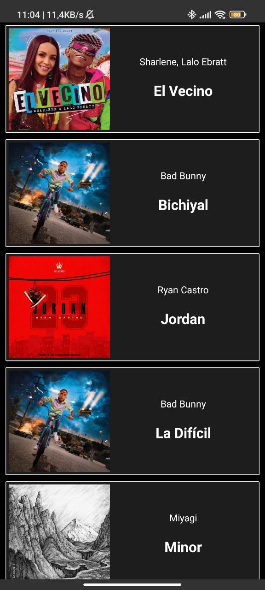

# MediaPlayer

The Media Player App is an [Android](https://www.android.com/) application that allows users to play audio files.



## Table of Contents

- [Features](#features)
- [Getting Started](#getting-started)
- [License](#license)

## Features

- Play audio files.
- Support for a wide range of multimedia formats.
- Basic playback controls: play, pause, stop, skip, volume control, etc.


## Getting Started

1. Clone the repository to your local machine:

   ```bash
   git clone https://github.com/enriqueseor/media-player.git

2. Open the directory with your Android Studio.
3. Configure a physical or virtual device.
4. Build and Run the project.

## License

This project is licensed under the [MIT License](LICENSE).
